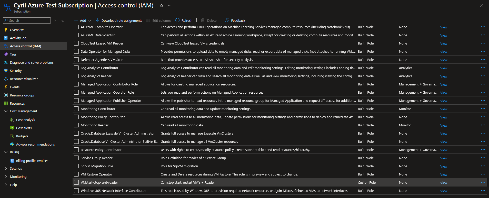
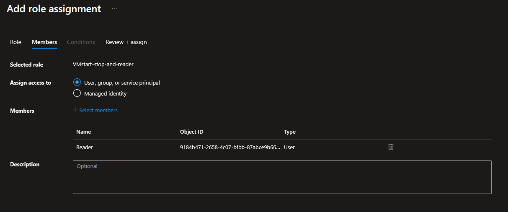
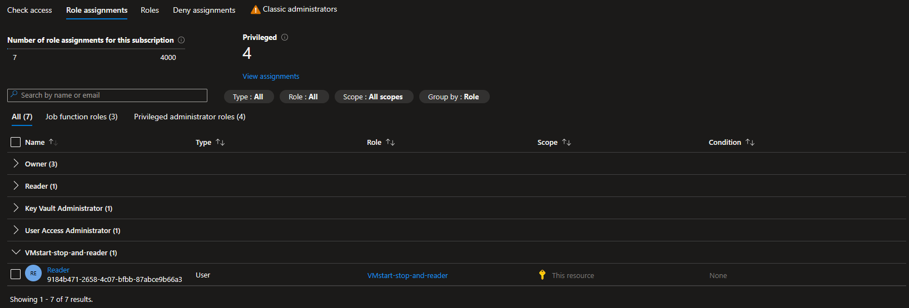
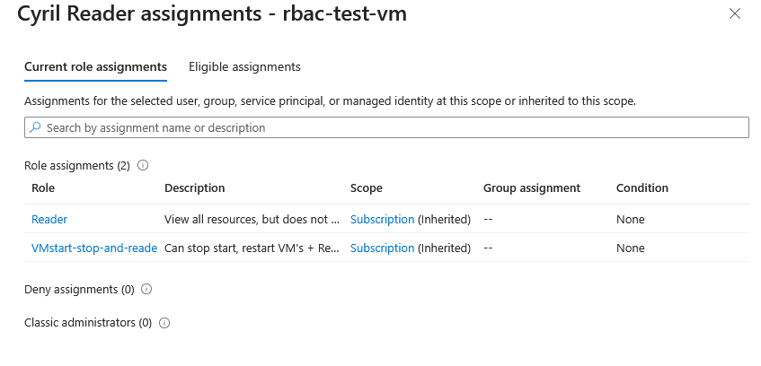
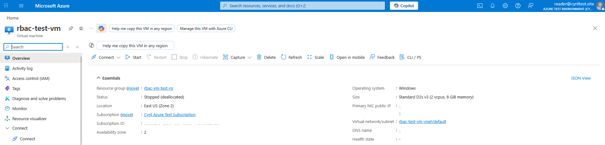
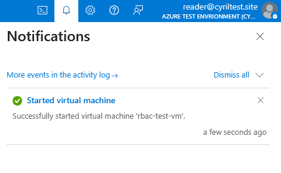
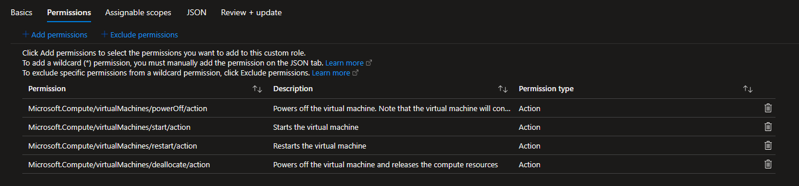
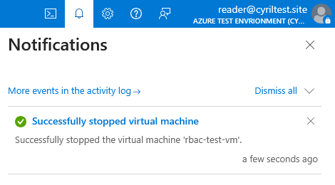
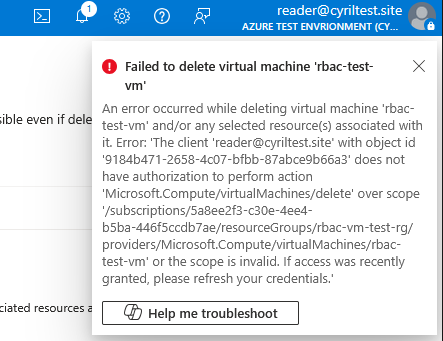

# Creating a Custom RBAC Role

Let's say we wanted to make a custom role that allowed a user to only Start, Power Off and Restart Virtual Machines.

Let's go to our Subscription > Add > Add custom role

We'll give it a name and description:

Next, we'll add permissions. Here's where it get's granular:

Let's select 'Microsoft Compute'

We'll scroll all the way down to 'Microsoft.Compute/virtualMachines' and select the controls we want this role to have.

We can see we can choose what actions the user is allowed to read or write. It can get very granular, which can be good!

We can verify our permissions for this role:

We can also select this Scope of this role. 

So if we only want our user to be able to start and stop VM's that are in a certain Resource Group, we can do that here:

I'll just let this user start and stop any Virtual Machine is our Subcription.

Let's observe and review the JSON:

We can see all ther permissions that we gave this role:

After, we'll  click 'Review and create'

### Assign Role to User

We can see our new Role in the Roles section of Access Control (IAM)

Let's click 'Add' and select our new Custom Role and add a Member:

Now if we look in our Role Assignments, we can see it's been added to our Reader user:

### Verify

Just to check these Role Permissions are in affect and working, I'll create a VM quickly.

Let's sign in to our Reader account and try to verify and test out our new permissions:

Let's try to start our VM:

It was successful!

*I tried stopping the VM from the Reader account and was not successful. After further research, we also need to add the deallocate permission in the role as well. I'll add that to the role quickly*

After signing in and out of my Reader account, I was able to stop the VM:

When trying to delete the VM, I am met with this error:

Very nice!