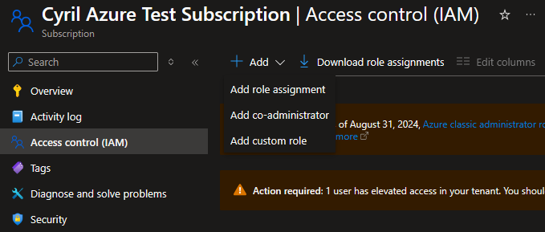
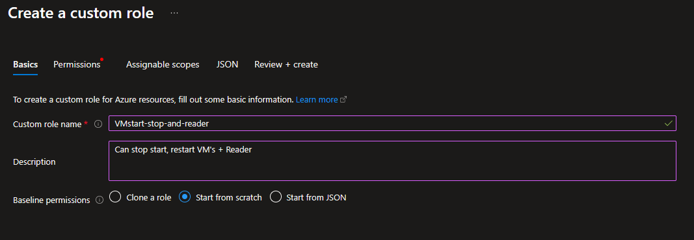
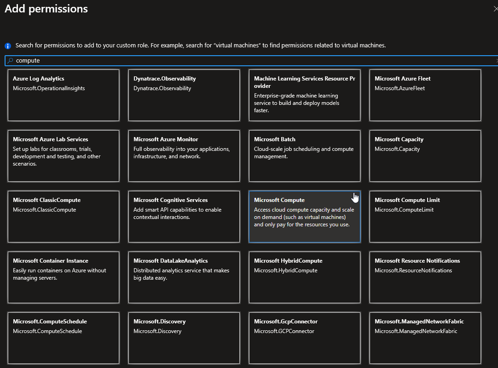
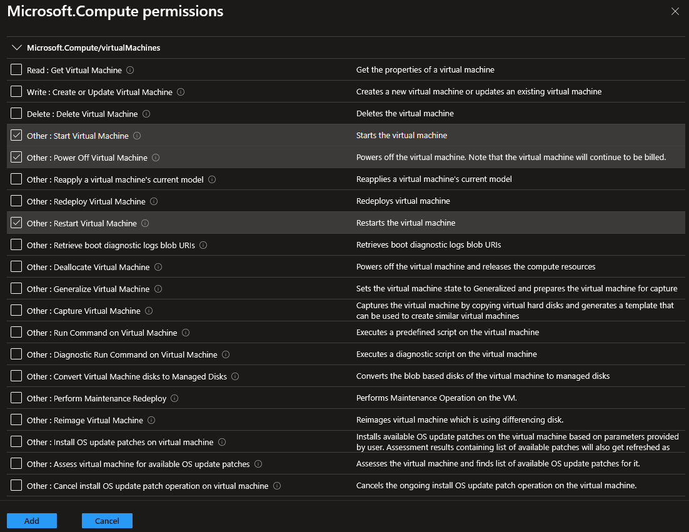
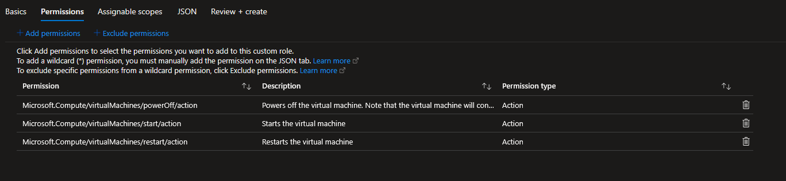
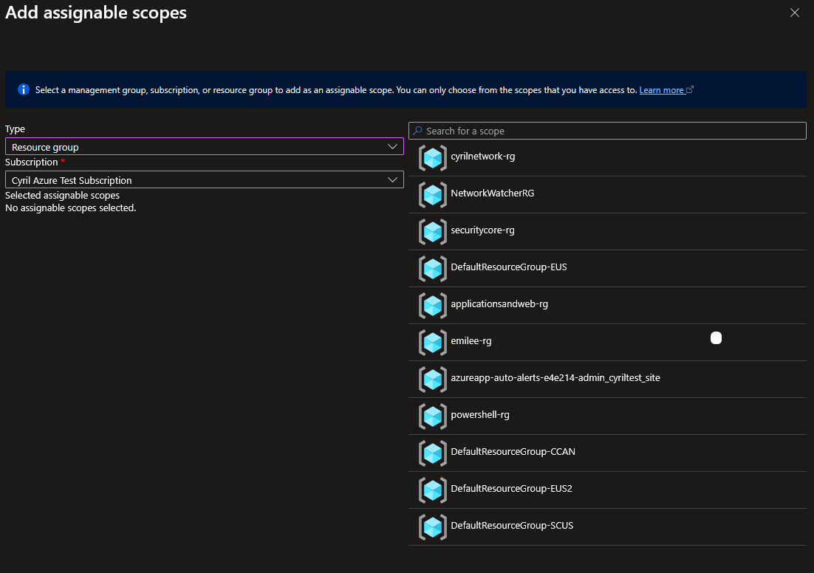
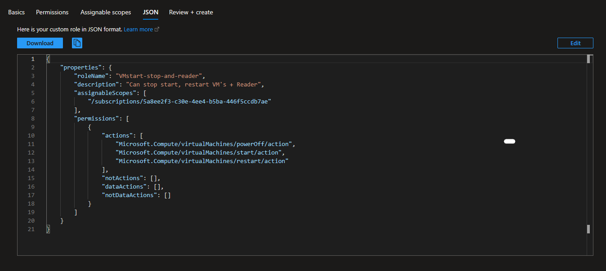

# Creating a Custom RBAC Role

Let's say we wanted to make a custom role that allowed a user to only Start, Power Off and Restart Virtual Machines.

Let's go to our Subscription > Add > Add custom role

We'll give it a name and description:

Next, we'll add permissions. Here's where it get's granular:

Let's select 'Microsoft Compute'

We'll scroll all the way down to 'Microsoft.Compute/virtualMachines' and select the controls we want this role to have.

We can see we can choose what actions the user is allowed to read or write. It can get very granular, which can be good!

We can verify our permissions for this role:

We can also select this Scope of this role. 

So if we only want our user to be able to start and stop VM's that are in a certain Resource Group, we can do that here:

I'll just let this user start and stop any Virtual Machine is our Subcription.

Let's observe and review the JSON:

We can see all ther permissions that we gave this role:

